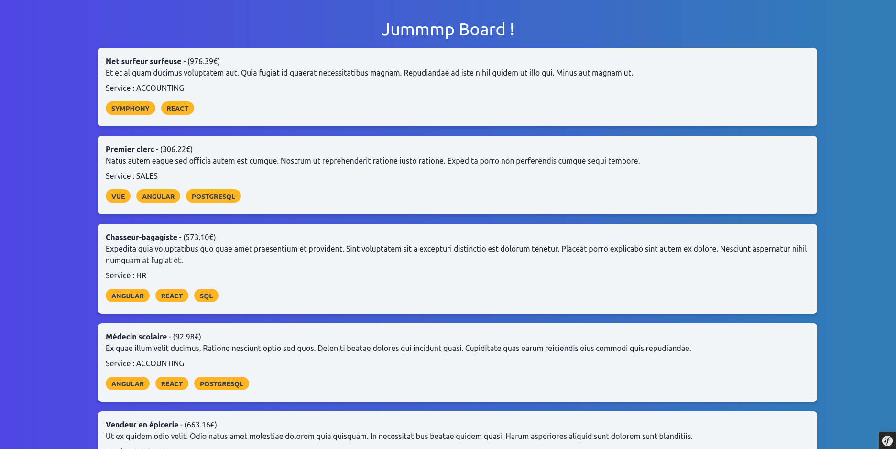

# jummmp Board

jummmp Board is a job listing platform built with PHP and the Symfony framework, designed to connect employers with potential candidates seamlessly.

## Features

- Employers can post job listings.
- Job seekers can browse and search for jobs.
- Users can create profiles to apply for jobs or post listings.
- Responsive design for mobile and desktop.



## Installation

To get started with jummmp Board, follow these steps:

1. Clone the repository:
   ```bash
   git clone https://github.com/your-username/jummmp-board.git
   ```
2. Navigate to the project directory:
   ```bash
   cd jummmp-board
   ```
3. Install dependencies:
   ```bash
   composer install
   ```
4. Configure your `.env` file with your database connection details.
5. Create the database schema:
   ```bash
   php bin/console doctrine:schema:create
   ```
6. Load any fixtures if available:
   ```bash
   php bin/console doctrine:fixtures:load
   ```
7. Start the server:
   ```bash
   symfony server:start
   ```

## Usage

Once installed, you can access the application through your web browser at the address provided by the Symfony server (usually http://127.0.0.1:8000).

## Contributing

We welcome contributions from the community. If you'd like to contribute, please fork the repository and use a feature branch. Pull requests are warmly welcome.

## Licensing

The code in this project is licensed under [INSERT LICENSE HERE].

## Contact

For any queries or feedback, please contact [INSERT CONTACT INFORMATION HERE].

Enjoy using jummmp Board for your recruitment needs!
